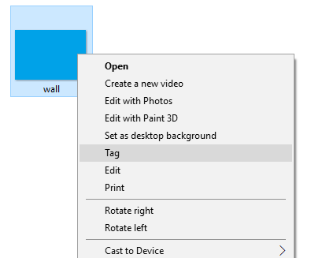
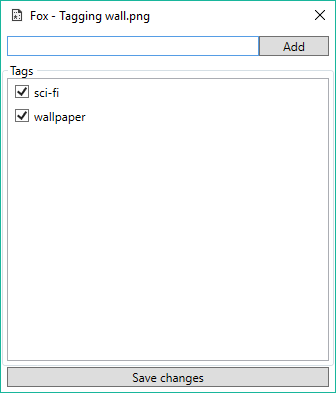
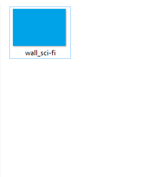

# Fox
A simple tool for windows to tag image files

It really isn't much more than just an easier way to rename files

It "tags" a file by appending the tag to the file name using an underscore as the seperator, allows for easier search in the file explorer.
&nbsp;

*Right click on an image and select the tag shell option*
&nbsp;

*Add tags, check existing tags and then save changes*
&nbsp;

*The result is the file with the tags added*
